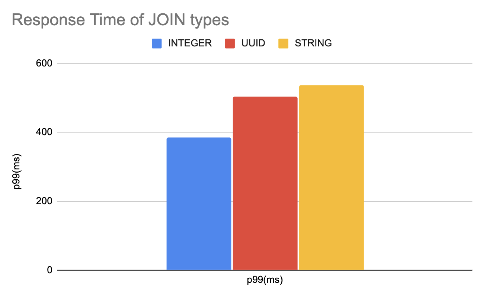

# Join Types Testing

To continue on the UUID performance thread, I was recently asked by a customer how joins perform with various data types.  
I had not run a specific test, but suspected perform would be driven mostly by the size of the data types.
For this test, two tables were created with 200k matching primary keys for UUID, STRING, and INTEGER data types.

The first table had one million rows and the second had 200k rows that matched.  The data type sizes are as follows:
* UUID :: 16 bytes
* STRING :: 36 bytes to store UUID as string
* INTEGER :: 8 bytes for default 64bit values

When data is stored in primary keys, CockroachDB uses prefix compression compress the primary key values.  
So, the best way is to look at the size of the *ranges* for the various tables.

```sql
-- UUID table (u1)
--
root@:26257/uuid> show ranges from table u1;
  start_key | end_key | range_id | range_size_mb | lease_holder | lease_holder_locality | replicas | replica_localities
------------+---------+----------+---------------+--------------+-----------------------+----------+---------------------
  NULL      | NULL    |       43 |     40.054517 |            1 |                       | {1}      | {""}
(1 row)

Time: 3.502521ms

-- STRING table (s1) :: Storing UUIDs
--
root@:26257/uuid> show ranges from table s1;
  start_key | end_key | range_id | range_size_mb | lease_holder | lease_holder_locality | replicas | replica_localities
------------+---------+----------+---------------+--------------+-----------------------+----------+---------------------
  NULL      | NULL    |       45 |            60 |            1 |                       | {1}      | {""}
(1 row)

Time: 3.098308ms

-- INTEGER table (i1) :: Storing INTEGER values
--
root@:26257/uuid> show ranges from table i1;
  start_key | end_key | range_id | range_size_mb | lease_holder | lease_holder_locality | replicas | replica_localities
------------+---------+----------+---------------+--------------+-----------------------+----------+---------------------
  NULL      | NULL    |       49 |     24.934101 |            1 |                       | {1}      | {""}
(1 row)

Time: 3.540118ms
```

As you might expect, the size of the data type does dictate performance.




## Start Single Node Test Database

```bash
./cockroach start-single-node --insecure
*
* WARNING: RUNNING IN INSECURE MODE!
*
* - Your cluster is open for any client that can access <all your IP addresses>.
* - Any user, even root, can log in without providing a password.
* - Any user, connecting as root, can read or write any data in your cluster.
* - There is no network encryption nor authentication, and thus no confidentiality.
*
* Check out how to secure your cluster: https://www.cockroachlabs.com/docs/v20.1/secure-a-cluster.html
*
*
* WARNING: neither --listen-addr nor --advertise-addr was specified.
* The server will advertise "glenn-abc-0001" to other nodes, is this routable?
*
* Consider using:
* - for local-only servers:  --listen-addr=localhost
* - for multi-node clusters: --advertise-addr=<host/IP addr>
*
*
*
* INFO: Replication was disabled for this cluster.
* When/if adding nodes in the future, update zone configurations to increase the replication factor.
*
CockroachDB node starting at 2020-10-13 22:38:58.464424769 +0000 UTC (took 0.4s)
build:               CCL v20.1.7 @ 2020/10/12 16:04:22 (go1.13.9)
webui:               http://glenn-abc-0001:8080
sql:                 postgresql://root@glenn-abc-0001:26257?sslmode=disable
RPC client flags:    ./cockroach <client cmd> --host=glenn-abc-0001:26257 --insecure
logs:                /home/glenn/cockroach-data/logs
temp dir:            /home/glenn/cockroach-data/cockroach-temp860485191
external I/O path:   /home/glenn/cockroach-data/extern
store[0]:            path=/home/glenn/cockroach-data
storage engine:      rocksdb
status:              initialized new cluster
clusterID:           b0e0d4e9-0395-4c32-bd42-bcba23c4de8f
nodeID:              1
```

## Create Database and populate tables

```sql
create database uuid;
use uuid;

create table u1 (id uuid primary key);
create table u2 (id uuid primary key);
create table s1 (id string primary key);
create table s2 (id string primary key);
create table i1 (id integer primary key);
create table i2 (id integer primary key);


insert into u1 select token from generate_series(1,1000000);
insert into u2 select token from u1 offset 400000 limit 200000;

insert into s1 select token::string from u1;
insert into s2 select token::string from u1 offset 400000 limit 200000;

insert into i1 select gs from generate_series(1,1000000) as gs;
insert into i2 select gs from generate_series(400001,600000) as gs;
```

## Queries to run for tests

```sql
select count(*) from u1 join u2 using (id);
select count(*) from s1 join s2 using (id);
select count(*) from i1 join i2 using (id);
```


## Run the tests using workload "querybench"

**Download workload binary:**
```bash
wget https://edge-binaries.cockroachdb.com/cockroach/workload.LATEST
chmod 755 workload.LATEST
mv ./workload.LATEST ./workload
chmod u+x ./workload
```

**Create file with all queries:**

```bash
tee all.sql <<EOF
select count(*) from u1 join u2 using (id);
select count(*) from s1 join s2 using (id);
select count(*) from i1 join i2 using (id);
EOF

```

**Run QueryBench with all.sql file**
```bash

$ ./workload run querybench postgres://root@localhost:26257/uuid?sslmode=disable --concurrency 1 --db uuid --duration 60s --display-every 10s --query-file all.sql
I201014 00:56:26.666826 1 workload/cli/run.go:356  creating load generator...
I201014 00:56:26.668940 1 workload/cli/run.go:387  creating load generator... done (took 2.10157ms)
_elapsed___errors__ops/sec(inst)___ops/sec(cum)__p50(ms)__p95(ms)__p99(ms)_pMax(ms)
   10.0s        0            0.8            0.8    453.0    486.5    486.5    486.5  1: select count(*) from u1 join u2 using (id);
   10.0s        0            0.8            0.8    486.5    503.3    503.3    503.3  2: select count(*) from s1 join s2 using (id);
   10.0s        0            0.7            0.7    352.3    352.3    352.3    352.3  3: select count(*) from i1 join i2 using (id);
   20.0s        0            0.8            0.8    453.0    486.5    486.5    486.5  1: select count(*) from u1 join u2 using (id);
   20.0s        0            0.8            0.8    486.5    520.1    520.1    520.1  2: select count(*) from s1 join s2 using (id);
   20.0s        0            0.8            0.7    335.5    352.3    352.3    352.3  3: select count(*) from i1 join i2 using (id);
   30.0s        0            0.8            0.8    469.8    503.3    503.3    503.3  1: select count(*) from u1 join u2 using (id);
   30.0s        0            0.7            0.8    486.5    536.9    536.9    536.9  2: select count(*) from s1 join s2 using (id);
   30.0s        0            0.8            0.8    335.5    385.9    385.9    385.9  3: select count(*) from i1 join i2 using (id);
   40.0s        0            0.7            0.8    469.8    486.5    486.5    486.5  1: select count(*) from u1 join u2 using (id);
   40.0s        0            0.8            0.8    486.5    503.3    503.3    503.3  2: select count(*) from s1 join s2 using (id);
   40.0s        0            0.8            0.8    335.5    352.3    352.3    352.3  3: select count(*) from i1 join i2 using (id);
   50.0s        0            0.8            0.8    469.8    486.5    486.5    486.5  1: select count(*) from u1 join u2 using (id);
   50.0s        0            0.8            0.8    486.5    503.3    503.3    503.3  2: select count(*) from s1 join s2 using (id);
   50.0s        0            0.8            0.8    335.5    352.3    352.3    352.3  3: select count(*) from i1 join i2 using (id);
   60.0s        0            0.8            0.8    453.0    486.5    486.5    486.5  1: select count(*) from u1 join u2 using (id);
   60.0s        0            0.8            0.8    486.5    503.3    503.3    503.3  2: select count(*) from s1 join s2 using (id);
   60.0s        0            0.8            0.8    335.5    352.3    352.3    352.3  3: select count(*) from i1 join i2 using (id);

_elapsed___errors_____ops(total)___ops/sec(cum)__avg(ms)__p50(ms)__p95(ms)__p99(ms)_pMax(ms)__total
   60.0s        0             47            0.8    460.7    469.8    486.5    503.3    503.3   1: select count(*) from u1 join u2 using (id);

_elapsed___errors_____ops(total)___ops/sec(cum)__avg(ms)__p50(ms)__p95(ms)__p99(ms)_pMax(ms)__total
   60.0s        0             47            0.8    480.6    486.5    503.3    536.9    536.9   2: select count(*) from s1 join s2 using (id);

_elapsed___errors_____ops(total)___ops/sec(cum)__avg(ms)__p50(ms)__p95(ms)__p99(ms)_pMax(ms)__total
   60.0s        0             47            0.8    334.7    335.5    352.3    385.9    385.9   3: select count(*) from i1 join i2 using (id);

_elapsed___errors_____ops(total)___ops/sec(cum)__avg(ms)__p50(ms)__p95(ms)__p99(ms)_pMax(ms)__result
   60.0s        0            141            2.3    425.3    469.8    503.3    520.1    536.9
```


